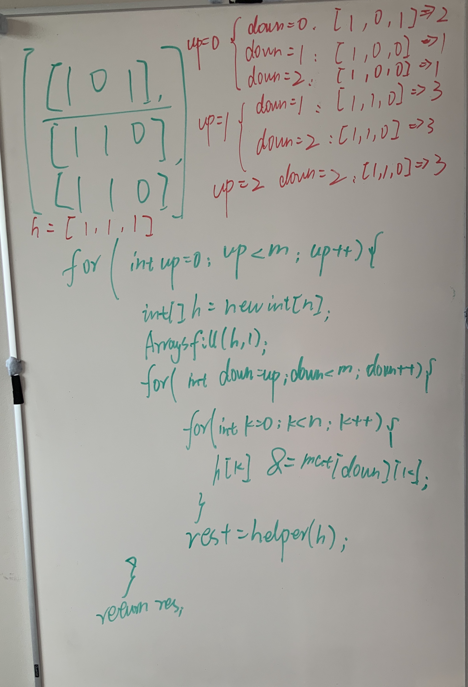

# 1504. Count Submatrices With All Ones

## Intuition

Start from a 1D array.

```java
public int numSubmat(int[] A) {
    int res = 0, length = 0;
    for (int i = 0; i < A.length; i++) {
        length = A[i] == 0 ? 0 : length + 1; // means every element in submatrices should only be 1, once meet 0, start count from another index
        res += length;
    }
    return res;
}
```

Let's solve 2D metrics by finding all 1 submetrics from row "up" to row "down". And apply above 1D helper function. The array `h[k] == 1` means **all values in column k from row "up" to "down" are 1 (that's why we use &)**. So overall, the idea is to "compress" the 2D array to the 1D array, and apply 1D array method on it, while trying all heights up to down.

**Time: O(M * N * M)**
**Space: O(N)**



```java
class Solution {
    public int numSubmat(int[][] mat) {
        int m = mat.length, n = mat[0].length;
        int res = 0;
        for (int up = 0; up < m; up++) {
            int[] h = new int[n];
            Arrays.fill(h, 1);
            for (int down = up; down < m; down++) {
                for (int k = 0; k < n; k++) {
                    h[k] &= mat[down][k]; // nested & between rows from up to down
                }
                res += helper(h);
            }
        }
        return res;
    }

    private int helper(int[] A) {
        int res = 0, length = 0;
        for (int i = 0; i < A.length; i++) {
            length = (A[i] == 0 ? 0 : length + 1);
            res += length;
        }
        return res;
    }
}
```
