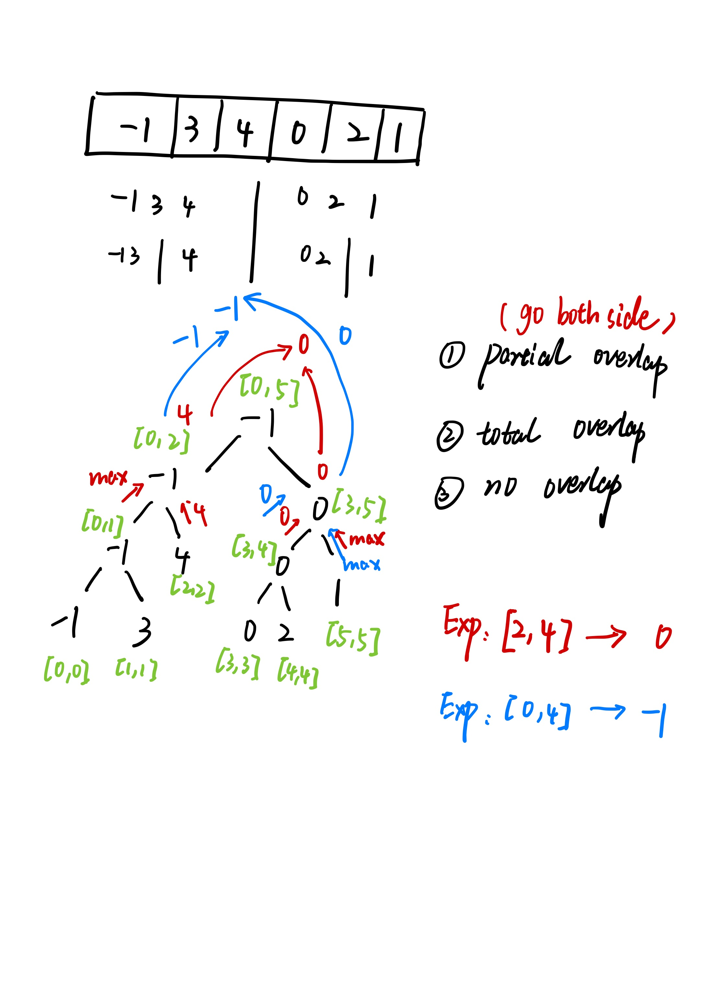

# Two Approaches

## Brute force

* if numbers are very big like `m` times, then time complexiaty will be `O(m * n)`

```java
class NumArray {
    int[] nums;
    public NumArray(int[] nums) {
        this.nums = nums;
    }

    public void update(int i, int val) {
        nums[i] = val;
    }

    public int sumRange(int i, int j) {
        int sum = 0;
        while (i <= j) {
            sum += nums[i++];
        }
        return sum;
    }
}

```

## Segment Tree

* if you are not familiar with segment tree, please check this [Segment tree tutorial][1].

## Notes




* solution using **SegmentTreeNode**

```java
class NumArray {

    class SegmentTreeNode {
        int start, end;
        SegmentTreeNode left, right;
        int sum;

        public SegmentTreeNode(int start, int end) {
            this.start = start;
            this.end = end;
            this.left = null;
            this.right = null;
            this.sum = 0;
        }
    }

    SegmentTreeNode root = null;

    public NumArray(int[] nums) {
        root = buildTree(nums, 0, nums.length - 1);
    }

    private SegmentTreeNode buildTree(int[] nums, int start, int end) {
        if (start > end) {
            return null;
        } else {
            SegmentTreeNode root = new SegmentTreeNode(start, end);
            if (start == end) {
                root.sum = nums[start];
            } else {
                int mid = start + (end - start) / 2;
                root.left = buildTree(nums, start, mid);
                root.right = buildTree(nums, mid + 1, end);
                root.sum = root.left.sum + root.right.sum;
            }
            return root;
        }
    }

    public void update(int i, int val) {
        update(root, i, val);
    }

    private void update(SegmentTreeNode root, int pos, int val) {
        if (root.start == root.end) {
            root.sum = val;
        } else {
            int mid = root.start + (root.end - root.start) / 2;
            if (pos <= mid) {
                update(root.left, pos, val);
            } else {
                update(root.right, pos, val);
            }
            root.sum = root.left.sum + root.right.sum;
        }
    }

    public int sumRange(int i, int j) {
        return sumRange(root, i, j);
    }

    private int sumRange(SegmentTreeNode root, int start, int end) {
        if (root.end == end && root.start == start) {
            return root.sum;
        } else {
            int mid = root.start + (root.end - root.start) / 2;
            if (end <= mid) {
                return sumRange(root.left, start, end);
            } else if (start >= mid + 1) {
                return sumRange(root.right, start, end);
            } else {
                return sumRange(root.right, mid + 1, end) + sumRange(root.left, start, mid);
            }
        }
    }
}
```

[1]: https://www.youtube.com/watch?v=ZBHKZF5w4YU
