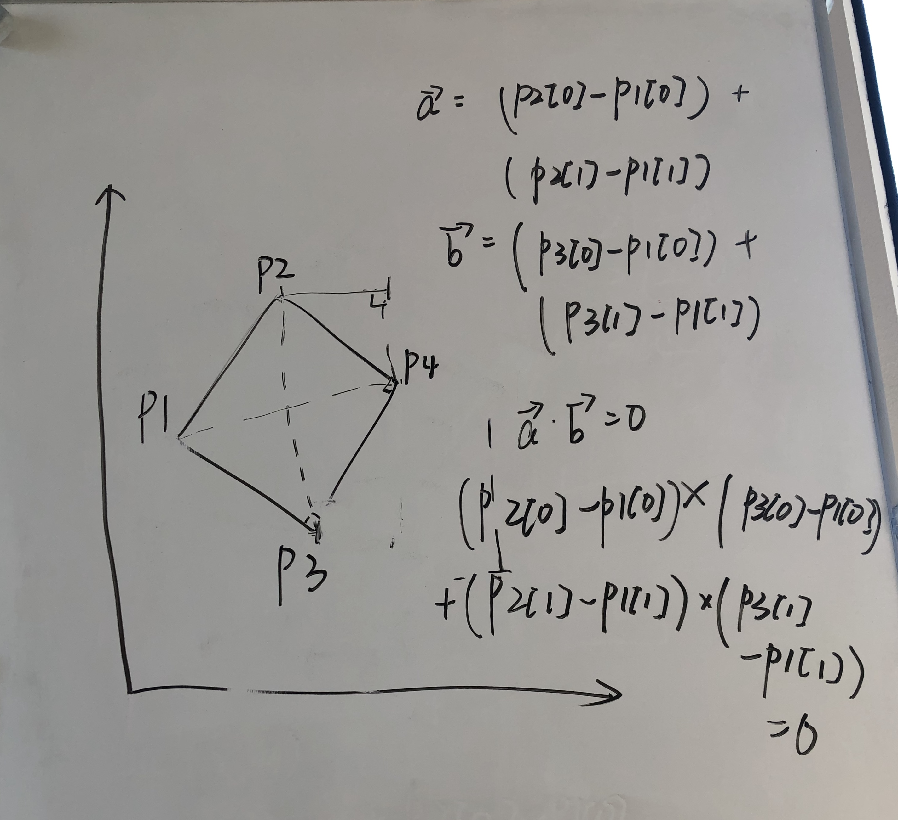

# Minimum Area Rectangle II

## Intuition

To find the minimal area rectangle, first we need to checkout that is there any valid rectangle exist, then compare them to get the smallest one.

Using a hashset to record the pairs we have already seen, traverse the points, using vector dot product prove a right angle.

```java
a * b = 0
a = (p2[0] - p1[0]) + (p2[1] - p1[1])
b = (p3[0] - p1[0]) + (p3[1] - p1[1])
a * b = (p2[0] - p1[0]) * (p3[0] - p1[0]) + (p2[1] - p1[1]) * (p3[1] - p1[1])
```

Another attribute of rectangle is the diagonal intercet point is the middle of two diagonals.

Assume p1, p2, p3, p4 realte coordinates are x1, x2, x3, x4.

```java
x_mid = (x1 + x4) / 2 = (x2 + x3) / 2
y_mid = (y1 + y4) / 2 = (y2 + y3) / 2

=> x4 = x3 + x2 - x1, y4 = y3 + y2 - y1
```



Now we need to check out that whether the set contains such `p4(x4, y4)`, if there is a valid `p4`, we jump to calculate the area and compare it using `Math.min(minArea, getArea(p1, p2, p3)`, else just jump into another index.

```java
class Solution {
    public double minAreaFreeRect(int[][] points) {
        double minArea = Double.MAX_VALUE;
        Set<String> set = new HashSet<>();
        for(int[] p:points) {
            set.add(p[0] + " " + p[1]);
        }

        for (int i = 0; i < points.length; i++) {
            for (int j = 0; j < points.length; j++) {
                for (int k = j + 1; k < points.length; k++) {
                    if (i == j || i == k) continue;
                    int[] p1 = points[i];
                    int[] p2 = points[j];
                    int[] p3 = points[k];
                    // vector dot product: a * b = x1 * x2 + y1 * y2
                    if ((p1[0] - p2[0]) * (p1[0] - p3[0]) + (p1[1] - p2[1]) * (p1[1] - p3[1]) != 0) continue;
                    int x = p3[0] + p2[0] - p1[0];
                    int y = p3[1] + p2[1] - p1[1];
                    if (!set.contains(x + " " + y)) continue;
                    minArea = Math.min(minArea, getArea(p1, p2, p3));
                }
            }
        }
        return minArea == Double.MAX_VALUE ? 0 : minArea;
    }

    private double getArea(int[] p1, int[] p2, int[] p3) {
        double L1 = getDist(p1, p2);
        double L2 = getDist(p1, p3);
        return L1 * L2;
    }

    private double getDist(int[] p1, int[] p2) {
        return Math.sqrt((p1[0] - p2[0]) * (p1[0] - p2[0]) + (p1[1] - p2[1]) * (p1[1] - p2[1]));
    }
}
```
