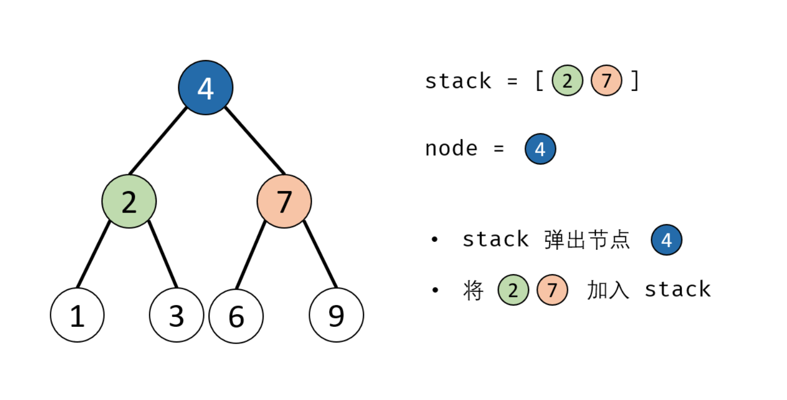
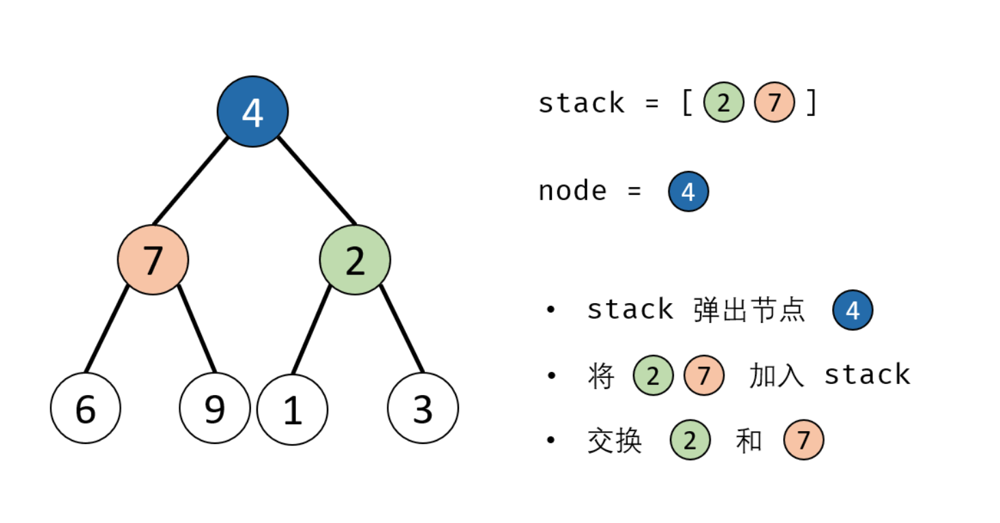

# 剑指 Offer 27. 二叉树的镜像

DFS

```java
1. recursion stop: when root == null, return null

2. recursion:
            1. use tmp to temporary store root.left
            2. start right recursion, store as root.left
            3. start left(use tmp) recursion, store as root.right

2. return root

```

```java
class Solution {
    public TreeNode mirrorTree(TreeNode root) {
        if (root == null) return null;
        TreeNode tmp = root.left;
        root.left = mirrorTree(root.right);
        root.right = mirrorTree(tmp);
        return root;
    }
}
```

use stack or queue to traverse all nodes，swap their left child and right child. When we swap two node, we swap two subtrees, not the only two nodes.

Stack solution.





```java
class Solution {
    public TreeNode mirrorTree(TreeNode root) {
        if (root == null) return null;

        Stack<TreeNode> s = new Stack<>();
        s.push(root);
        while (!s.isEmpty()) {
            TreeNode node = s.pop();
            if (node.left != null) {
                s.push(node.left);
            }
            if (node.right != null) {
                s.push(node.right);
            }
            TreeNode tmp = node.left;
            node.left = node.right;
            node.right = tmp;
        }
        return root;
    }
}
```

[reference](https://leetcode-cn.com/problems/er-cha-shu-de-jing-xiang-lcof/solution/mian-shi-ti-27-er-cha-shu-de-jing-xiang-di-gui-fu-/)

Similar BFS.

```java
class Solution {
    public TreeNode mirrorTree(TreeNode root) {
        if (root == null) return null;

        Queue<TreeNode> q = new LinkedList<>();
        q.offer(root);
        while (!q.isEmpty()) {
            TreeNode node = q.poll();
            if (node.left != null) {
                q.offer(node.left);
            }
            if (node.right != null) {
                q.offer(node.right);
            }
            TreeNode tmp = node.right;
            node.right = node.left;
            node.left = tmp;
        }
        return root;
    }
}
```
