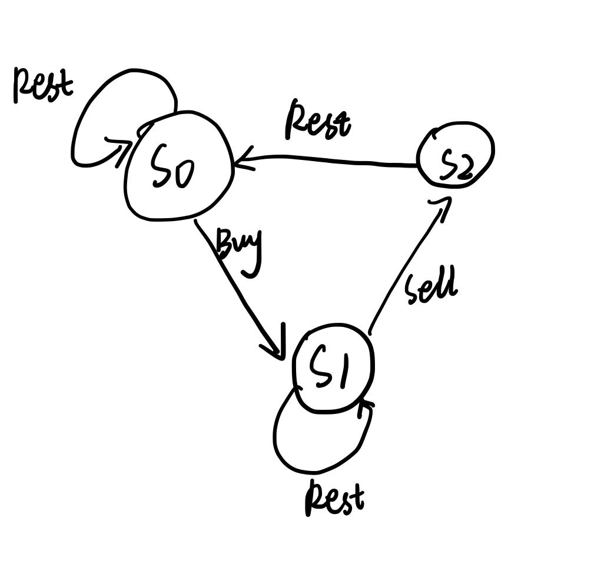

# 309. Best Time to Buy and Sell Stock with Cooldown

State Machine.

```java
class Solution {
    public int maxProfit(int[] prices) {
        int n = prices.length;
        if (n <= 1) return 0;
        int[] s0 = new int[n];
        int[] s1 = new int[n];
        int[] s2 = new int[n];
        s0[0] = 0;
        s1[0] = -prices[0];
        s2[0] = Integer.MIN_VALUE;
        for (int i = 1; i < n; i++) {
            s0[i] = Math.max(s0[i - 1], s2[i - 1]);
            s1[i] = Math.max(s1[i - 1], s0[i - 1] - prices[i]);
            s2[i] = s1[i - 1] + prices[i];
        }
        return Math.max(s0[n - 1], s2[n - 1]);
    }
}
```



Improve the space complexity to `O(1)`

```java
class Solution {
    public int maxProfit(int[] prices) {
        if (prices.length <= 1) return 0;
        int sold = 0, hold = -prices[0], rest = 0;
        for (int i = 0; i < prices.length; i++) {
            int prevSold = sold;
            sold = hold + prices[i]; // s2: take a rest
            hold = Math.max(hold, rest - prices[i]); // s1: can sell
            rest = Math.max(rest, prevSold); // s0: can buy
        }
        return Math.max(rest, sold);
    }
}
```
