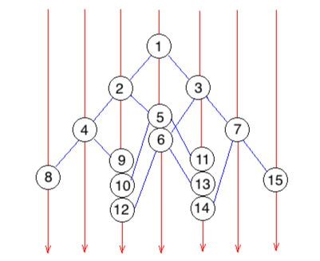

# 987. Vertical Order Traversal of a Binary Tree

1. we use a hashmap to record the x-coordinate of the nodes, and record the minX and maxX to get the values.

2. we use a treemap to record the y-coordinate of the nodes, and use a priorityQueue to keep the ascending order.

Possible Questions:

why use hashmap first then treemap？
This is because hashmap can get the key in constant time, while treemap gets the key in O(logn) time, where n is the number of nodes. We need to traverse the hashmap from the smallest x to the highest x. And it is easy to realize that the value of x is always continuous. That is, the difference between two continugous x will only be 1. Thus, to traverse the hashmap, we just need to record the number of minimum x and maximum x.

Unlike x, the value of y is not contiuous. And that's why we need a treemap. The function "keySet()" of treemap will return a series of keys in ascending order. And we can easily traverse the treemap by that.

Why use priorityQueue?
Acutally it does not matter whether you use a priorityQueue or a List. The time complexity does not differ a lot. I think it is also a good idea to use ArrayList, and we need to sort it when we copy it to the final output.

```java
class Solution {
    Map<Integer, TreeMap<Integer, PriorityQueue<Integer>>> map = new HashMap<>();
    int minX = 0, maxX = 0;
    public List<List<Integer>> verticalTraversal(TreeNode root) {
        dfs(root, 0, 0);
        List<List<Integer>> vertical = new ArrayList<>();
        for (int i = minX; i <= maxX; i++) {
            List<Integer> level = new ArrayList<>();
            for (int key : map.get(i).keySet()) {
                while (!(map.get(i).get(key)).isEmpty()) {
                    level.add(map.get(i).get(key).poll());
                }
            }
            vertical.add(level);
        }
        return vertical;
    }

    private void dfs(TreeNode node, int x, int y) {
        if (node == null) return;
        minX = Math.min(x, minX);
        maxX = Math.max(x, maxX);
        if (map.get(x) == null) {
            map.put(x, new TreeMap<Integer, PriorityQueue<Integer>>());
        }
        if (map.get(x).get(y) == null) {
            map.get(x).put(y, new PriorityQueue<Integer>());
        }
        map.get(x).get(y).add(node.val);
        dfs(node.left, x - 1, y + 1);
        dfs(node.right, x + 1, y + 1);
    }
}
```

## 314. Binary Tree Vertical Order Traversal



```java
class Solution {
    public List<List<Integer>> verticalOrder(TreeNode root) {
        List<List<Integer>> res = new ArrayList<>();
        if (root == null) {
            return res;
        }

        Map<Integer, ArrayList<Integer>> map = new HashMap<>();
        Queue<TreeNode> q = new LinkedList<>();
        Queue<Integer> cols = new LinkedList<>();
        q.add(root);
        cols.add(0);
        int min = 0, max = 0;
        while (!q.isEmpty()) {
            TreeNode node = q.poll();
            int col = cols.poll();

            if (!map.containsKey(col)) {
                map.put(col, new ArrayList<Integer>());
            }
            map.get(col).add(node.val);

            if (node.left != null) {
                q.add(node.left);
                cols.add(col - 1);
                min = Math.min(min, col - 1);
            }

            if (node.right != null) {
                q.add(node.right);
                cols.add(col + 1);
                max = Math.max(max, col + 1);
            }
        }

        for (int i = min; i <= max; i++) {
            res.add(map.get(i));
        }
        return res;
    }
}
```
