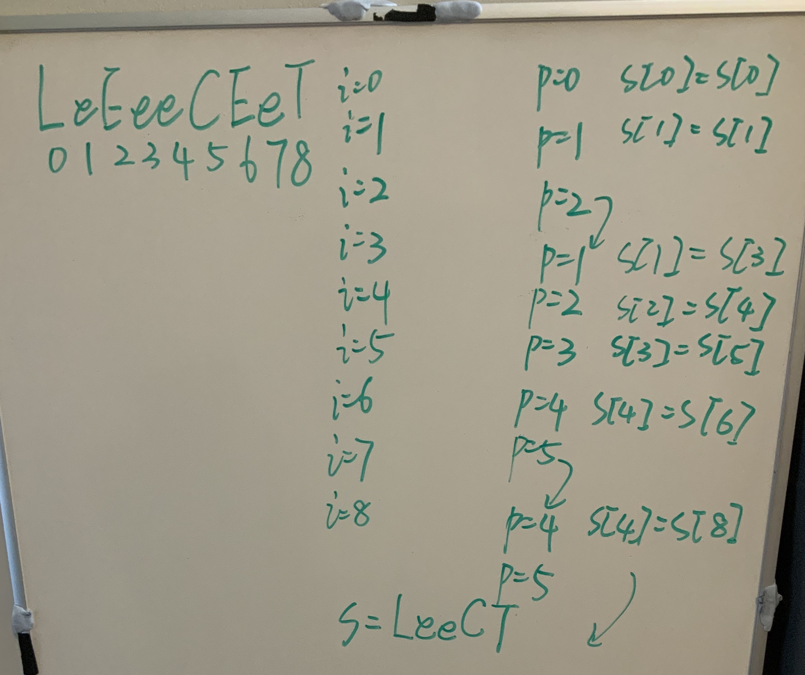

# 1544. Make The String Great

brute force, worst case `O(n * n)` time, `O(n)` space.

```java
class Solution {
    public String makeGood(String s) {
        return makeGood(s, 0);
    }

    private String makeGood(String s, int sz) {
        while (sz != s.length()) {
            sz = s.length();
            for (int i = 0; i + 1 < s.length(); ++i) {
                if (s.charAt(i) != s.charAt(i + 1) && Character.toUpperCase(s.charAt(i)) == Character.toUpperCase(s.charAt(i + 1))) {
                    s = s.substring(0, i) + s.substring(i + 2);
                }
            }
        }
        return s;
    }
}
```

Stack solution: `O(n)` time, `O(n)` space.

```java
class Solution {
    public String makeGood(String s) {
        Stack<Character> stack = new Stack<>();
        int i = 0;
        while (i < s.length()) {
            if (!stack.isEmpty() && s.charAt(i) != stack.peek() && Character.toUpperCase(s.charAt(i)) == Character.toUpperCase(stack.peek())) {
                i++;
                stack.pop();
            } else {
                stack.push(s.charAt(i++));
            }
        }
        StringBuilder sb = new StringBuilder();
        while (!stack.isEmpty()) {
            sb.append(stack.pop());
        }
        return sb.reverse().toString();
    }
}
```

Optimization: `O(n)` time, `O(1)` space

```java
class Solution {
    public String makeGood(String s) {
        return makeGood(s.toCharArray(), 0);
    }

    private String makeGood(char[] s, int p) {
        for (int i = 0; i < s.length; ++i) {
            if (p >= 1 && s[i] != s[p - 1] && Character.toUpperCase(s[i]) == Character.toUpperCase(s[p - 1])) {
                p -= 1;
            } else {
                s[p++] = s[i];
            }
        }
        return String.valueOf(s).substring(0, p);
    }
}
```


