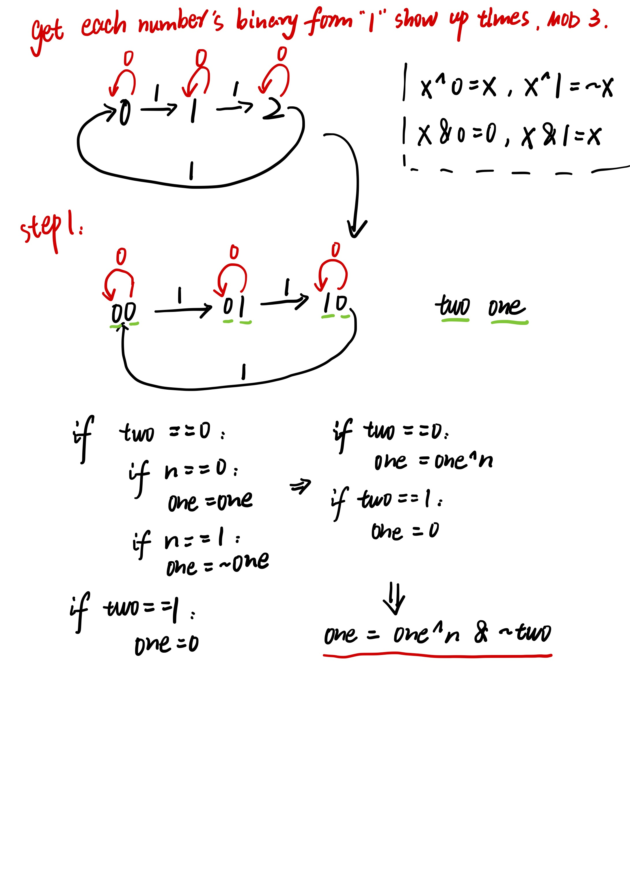
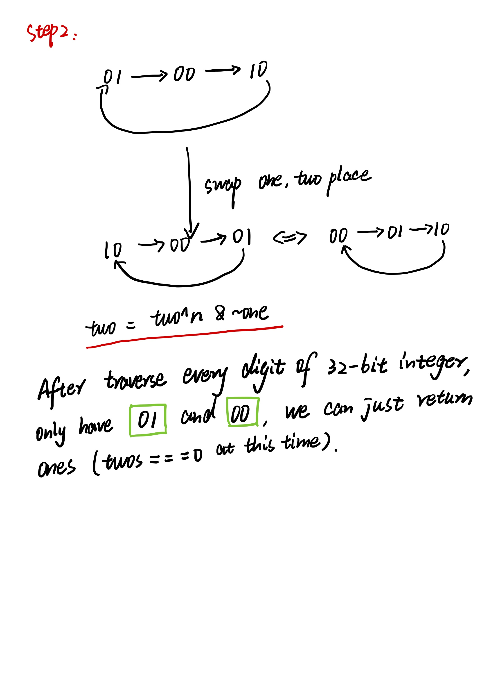

# 剑指 Offer 56 - II. 数组中数字出现的次数

```java
class Solution {
    public int singleNumber(int[] nums) {
        int ones = 0, twos = 0;
        for (int n : nums) {
            ones = ones ^ n & ~twos;
            twos = twos ^ n & ~ones;
        }
        return ones;
    }
}
```

State Machine.



