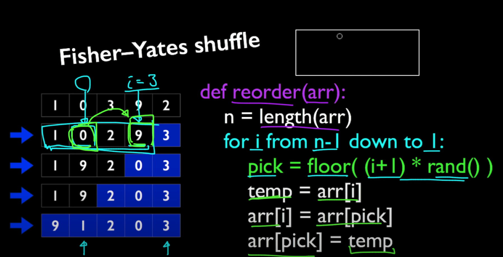

# Random Flip Matrix

## Intuition

start from the last index, swap it with a random generaled element, then keep decrease the total number of elements. It'a `O(N)` algorithm.

**Fisher–Yates shuffle** check this link for introduction: <https://www.youtube.com/watch?v=CoI4S7z1E1Y>



```java
class Solution {
    private Map<Integer, Integer> map;
    private int rows, cols, total;
    private Random rand;

    public Solution(int n_rows, int n_cols) {
        rows = n_rows;
        cols = n_cols;
        map = new HashMap<>();
        rand = new Random();
        total = rows * cols;
    }

    public int[] flip() {
        int r = rand.nextInt(total--); // generate index, decrease total number of values

        int x = map.getOrDefault(r,r); // check if we have already put something at this index

        map.put(r, map.getOrDefault(total, total)); // swap - put total at index that we generated

        return new int[] {x / cols, x % cols}; // [row.id, col.id]
    }

    public void reset() {
        map.clear();
        total = cols * rows;
    }
}

/**
 * Your Solution object will be instantiated and called as such:
 * Solution obj = new Solution(n_rows, n_cols);
 * int[] param_1 = obj.flip();
 * obj.reset();
 */
```
